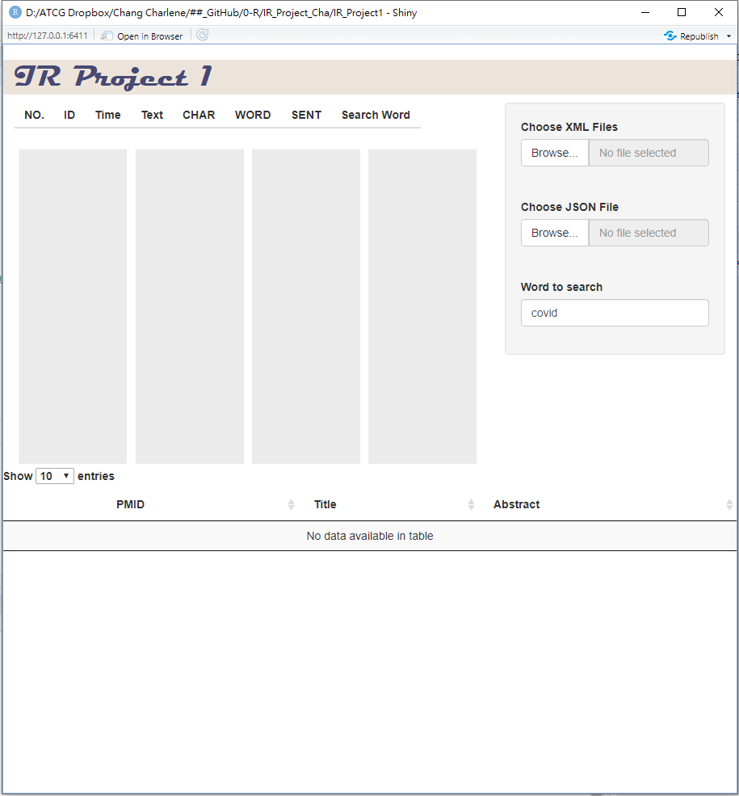

# IR Project 1

Created by: 張嘉容 P88071020
Created time: October 10, 2021 3:52 PM
Last edited time: October 10, 2021 4:32 PM
Solved: No

## Introduction

In this project, we can use the UI by R shiny to search the keywords and have  text-statistics for the PubMed XML files and Twitter JASON files.

We can directly visit the URL: [http://XXXXX](http://xxxxx/) to perform the above operations or have the following step in R:

### Required software

First we need to install and load those packages:

```r
##### Load library ########
library(readr)
library(DT)
library(magrittr) 
library(ggplot2)
library(pdp)
library(shiny)
library(XML)
library(jsonlite)
library(tibble)
library(tidytext)

library(data.table)
library(dplyr) # For `filter_all` and `mutate_all`.
library(Hmisc)
library(quanteda)
library(stringr)
```

### Open ui.R and Run App

Open the ui.R, the R script of the UI is as follows:

```r
##### UI ########
ui = tagList(
  # https://stackoverflow.com/questions/57037758/r-shiny-how-to-color-margin-of-title-panel
  titlePanel(h1("IR Project 1",
                style='background-color:#ece4db;  
                     color:#474973;
                     font-weight: 500;
                     font-family: Magneto;
                     line-height: 1.2;
                     padding-left: 15px')), 
  fluidPage(
  sidebarLayout(
    position = "right",
    sidebarPanel(
      fileInput("file1", "Choose XML Files", accept = ".xml", multiple = T),
      fileInput("file2", "Choose JSON File", accept = ".json", multiple = T),
      textInput("word_select", label = "Word to search","covid")
    ),
    mainPanel(
      tableOutput("SumTable"),
      plotOutput("HisFig"))
  ),
  fluidRow(
    dataTableOutput("table")
  )
)
)
```

After pressing the Run App button, we can see the following screen:



After Loading the XML files or JSON files, we can have text-statistics and keyword search.

Note: Only one file format can be entered at a time, and the page needs to be refreshed before importing files in different formats

- **Examples of XML files**

.png)

- **Examples of JASON files**

.png)
